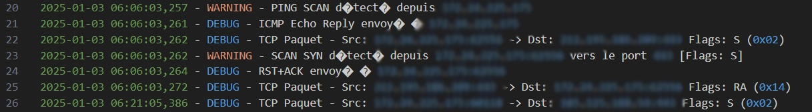

# 🕵️ Port Scanner Trap - Monitor. Detect. Defend.

<div>
  
</div>

## 📖 Description

Un outil de détection de scans de ports qui identifie et répond aux tentatives de reconnaissance réseau.

## ✨ Fonctionnalités

### 🔍 Types de Scans Détectés

#### 🌐 Scans TCP
- **SYN Scan** (-sS) : Scan TCP classique à demi-ouvert
  * 🎯 Détection des flags SYN purs
  * 🛡️ Réponse automatique RST+ACK
- **FIN Scan** (-sF) : Scan utilisant le flag FIN
- **XMAS Scan** (-sX) : Scan utilisant les flags FIN, PSH et URG
- **NULL Scan** (-sN) : Scan sans aucun flag TCP
- **ACK Scan** (-sA) : Scan utilisant le flag ACK

#### 📡 Scans UDP
- Détection des scans UDP (-sU)
- Réponse automatique avec ICMP Port Unreachable

#### 🔔 Scans ICMP
- **Ping Scan** (-sn) : Détection des Echo Request
  * 🔄 Réponse automatique avec ICMP Echo Reply
- **Timestamp Scan** : Détection des requêtes timestamp ICMP
- **Address Mask Scan** : Détection des requêtes de masque d'adresse

### 🚀 Fonctionnalités Avancées
- 🔲 Exécution en arrière-plan
- ⏱️ Rate limiting par IP source
- 📝 Logging détaillé des tentatives avec :
  * ⌚ Horodatage précis
  * 🌍 Adresses IP source et destination
  * 🔢 Ports source et destination
  * 🏁 Flags TCP en format lisible (ex: S pour SYN)
- 🛡️ Réponses actives aux scans
- 🎯 Sélection automatique de l'interface réseau appropriée
- ⚡ Gestion des erreurs robuste

## 📋 Prérequis

- 🐍 Python 3.x
- 🔧 Npcap installé
- 👑 Privilèges administrateur
- 📦 Modules Python requis (voir requirements.txt)

## 💾 Installation

1. 📥 Cloner le repository
2. 📦 Installer les dépendances :
```bash
pip install -r requirements.txt
```
3. 🔧 Installer Npcap si ce n'est pas déjà fait

## 🎮 Utilisation

### 🚦 Modes d'exécution

1. **🖥️ Mode Console (avec fenêtre)**
```powershell
python main.py
```
- 📺 Affiche les messages dans la console
- 👀 Permet de voir les avertissements en temps réel
- 🔧 Utile pour le débogage et les tests
- ⌨️ Arrêt avec Ctrl+C

2. **🎯 Mode Arrière-plan (sans fenêtre)**
```powershell
pythonw main.py
```
- 🔲 S'exécute silencieusement en arrière-plan
- 🚫 Pas de fenêtre console
- ✨ Idéal pour une utilisation en production
- 📝 Voir le fichier log pour suivre l'activité

### 🛑 Arrêt du programme

1. **🖥️ Mode Console** :
   - ⌨️ Appuyez sur Ctrl+C dans la fenêtre console

2. **🔲 Mode Arrière-plan** :
   - Via le Gestionnaire des tâches Windows :
     * 🔍 Ouvrir le Gestionnaire des tâches (Ctrl+Shift+Esc)
     * 🔎 Chercher le processus "pythonw.exe"
     * 🛑 Cliquer sur "Fin de tâche"
   - Via PowerShell :
     ```powershell
     Stop-Process -Name pythonw -Force
     ```

### 🧪 Tests avec Nmap

Voici différentes commandes qui permettent de tester la détection avec nmap :

```bash
# Test scan SYN basique
nmap -sS [ip_cible]

# Test scan FIN
nmap -sF [ip_cible]

# Test scan XMAS
nmap -sX [ip_cible]

# Test scan NULL
nmap -sN [ip_cible]

# Test scan UDP
nmap -sU [ip_cible]

# Test scan ACK
nmap -sA [ip_cible]

# Test ping scan
nmap -sn [ip_cible]

# Scan complet avec tous les ports
nmap -p- [ip_cible]
```

### ℹ️ Notes importantes

1. **💡 Message "Mac address to reach destination not found"** :
   - ✅ Ce message est normal et n'indique pas d'erreur
   - 🔄 Il apparaît lors du premier envoi de paquets à une nouvelle destination
   - 📡 Le programme utilise automatiquement l'adresse broadcast dans ce cas
   - ✨ N'affecte pas la fonctionnalité de détection et de réponse

### 📝 Logs
Les détections sont enregistrées dans le fichier `scan_detection.log` avec les informations suivantes :
- ⌚ Timestamp
- 🔍 Type de scan détecté
- 🌍 IP source et port source
- 🎯 IP destination et port destination
- 🏁 Flags TCP (en format lisible)
- 📤 Réponses envoyées
- ⚠️ Erreurs éventuelles

<div>
  
</div>

## 🔒 Sécurité

- 👑 Le programme nécessite des privilèges administrateur pour la capture de paquets
- 📚 Les logs sont en mode append pour conserver l'historique
- ⏱️ Rate limiting pour éviter la saturation des logs
- 🛡️ Réponses actives pour tromper les scanners
- 🔐 Gestion sécurisée des erreurs

## 🔧 Dépannage

1. ❌ "Layer [IP] not found" :
   - ✔️ Vérifier l'installation de Npcap
   - 👑 Vérifier les privilèges administrateur

2. 🔒 "EBUSY: resource busy or locked" lors de la suppression du fichier log :
   - 🛑 Arrêter d'abord le programme comme indiqué ci-dessus
   - 📝 Fermer tous les éditeurs qui pourraient avoir le fichier ouvert

## 🤝 Contribution

Les contributions sont les bienvenues ! N'hésitez pas à :
- 🐛 Signaler des bugs
- 💡 Proposer des nouvelles fonctionnalités
- 📚 Améliorer la documentation
- 🔄 Soumettre des pull requests

## 📄 Licence

Ce projet est sous licence MIT. Voir le fichier LICENSE pour plus de détails.
